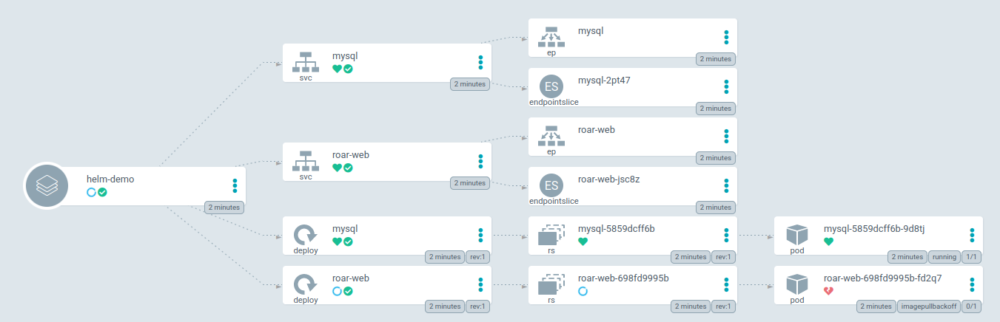

# Lab2: using help

## create project
```shell
argocd proj create helmproj
# allow access to cluster resources to allow creation of the namespace
argocd proj allow-cluster-resource helmproj '*' '*'
argocd proj add-source helmproj '*'
argocd proj add-destination helmproj '*' '*'

```

## create project helm-demo
```shell
# kubectl create ns helm-demo
argocd app create helm-demo --project helmproj \
--sync-policy automated  --sync-option CreateNamespace=true \
--values values.yaml \
--repo https://github.com/shalabi67/KubernetesGitOps --path argocd/roar-k8s-helm/helm \
--dest-server $CLUSTER_IP --dest-namespace helm-demo

```

After creating the project you will find that the roar-web pod is not running. 

this is because the pod image tag is wrong instead of 1.10.1 it should be 1.0.1.

## fix app
go to the file values.yaml and change roar-web image tg to tag: 1.0.1. and push your changes.

