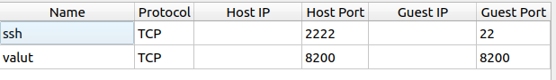

# Kubernetes with external vault
This shows how to define a kind cluster with and external vault running on a VM.
The VM uses nats, thus it will port forward the 8200 and the 22 ports as shown in the figure.


For more information see [kubernetes-external-vault](https://developer.hashicorp.com/vault/tutorials/kubernetes/kubernetes-external-vault)
and [ault-secrets-operator](https://developer.hashicorp.com/vault/tutorials/kubernetes/vault-secrets-operator)

## pre setup
Install helm vault repo
```shell
helm repo add hashicorp https://helm.releases.hashicorp.com
helm repo update
```
## setup kind cluster
To setup the kind cluster we will use the `kind.yaml` file to create the cluster. in the kind file notice `apiServerAddress`
which point to the machine running kind ip address. this will make the kind cluster has the same ip as the host 
machine and thus will be accessible by vault.
```shell
kind create cluster --config kind.yaml
```

Install the latest version of the Vault server running in external mode. notice that 10.16.124.179 is the dell 
laptop ip address
```shell
helm install vault hashicorp/vault \
    --set "global.externalVaultAddr=http://10.16.124.179:8200"
    
```

Use helm to deploy the Vault Secrets Operator.
```shell
helm install vault-secrets-operator hashicorp/vault-secrets-operator -n vault-secrets-operator-system --create-namespace --values vault-operator-values.yaml

```

## Run demo
### setup vault secrets and auth
You run these on the vault machine.
```shell

KUBE_CA_CERT=$(kubectl config view --raw --minify --flatten --output='jsonpath={.clusters[].cluster.certificate-authority-data}' | base64 --decode)
KUBE_HOST=$(kubectl config view --raw --minify --flatten --output='jsonpath={.clusters[].cluster.server}')
VAULT_HELM_SECRET_NAME=$(kubectl get secrets --output=json | jq -r '.items[].metadata | select(.name|startswith("vault-token-")).name'
TOKEN_REVIEW_JWT=$(kubectl get secret $VAULT_HELM_SECRET_NAME --output='go-template={{ .data.token }}' | base64 --decode)
vault secrets enable --tls-skip-verify -path=kvv2 kv-v2
vault policy write --tls-skip-verify dev - <<EOF
path "kvv2/*" {
   capabilities = ["read"]
}
EOF

vault auth enable -path demo-auth-mount kubernetes
vault auth enable --tls-skip-verify -path demo-auth-mount kubernetes
vault write --tls-skip-verify auth/demo-auth-mount/config      token_reviewer_jwt="$TOKEN_REVIEW_JWT"      kubernetes_host="$KUBE_HOST"      kubernetes_ca_cert="$KUBE_CA_CERT"      issuer="https://kubernetes.default.svc.cluster.local"

# notice the name of the role is role1 which will be used later when we deploy on kubernetes
vault write --tls-skip-verify auth/demo-auth-mount/role/role1    bound_service_account_names=default    bound_service_account_namespaces=app    policies=dev    audience=vault    ttl=24h

vault kv put --tls-skip-verify kvv2/webapp/config username="static-user" password="static-password"

```
```shell
kubectl create ns app
kubectl apply -f vault-auth-static.yaml
kubectl apply -f static-secret.yaml
```
