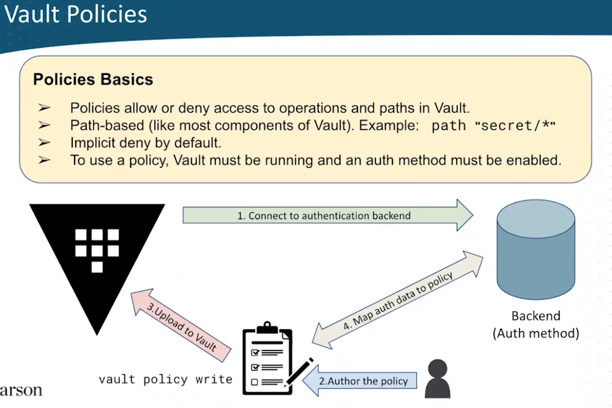

# Policies


policies are stored in the sys path to read the default policy `vault read sys/policy/default`

For a lab in poliy please have a look at [lab](https://github.com/daveprowse/vac-course/tree/main/lab-05)

## Lab

```shell
vault policy write admin - <<EOF 
# Read system health check
path "sys/health"
{
  capabilities = ["read", "sudo"]
}

# Create and manage ACL policies broadly across Vault

# List existing policies
path "sys/policies/acl"
{
  capabilities = ["list"]
}

# Create and manage ACL policies
path "sys/policies/acl/*"
{
  capabilities = ["create", "read", "update", "delete", "list", "sudo"]
}

# Enable and manage authentication methods broadly across Vault

# Manage auth methods broadly across Vault
path "auth/*"
{
  capabilities = ["create", "read", "update", "delete", "list", "sudo"]
}

# Create, update, and delete auth methods
path "sys/auth/*"
{
  capabilities = ["create", "update", "delete", "sudo"]
}

# List auth methods
path "sys/auth"
{
  capabilities = ["read"]
}

# Enable and manage the key/value secrets engine at `secret/` path

# List, create, update, and delete key/value secrets
path "secret/*"
{
  capabilities = ["create", "read", "update", "delete", "list", "sudo"]
}

# Manage secrets engines
path "sys/mounts/*"
{
  capabilities = ["create", "read", "update", "delete", "list", "sudo"]
}

# List existing secrets engines.
path "sys/mounts"
{
  capabilities = ["read"]
}

EOF
```

### test policy
```shell
vault policy list
vault policy read admin

```

### test policy using token
```shell
vault token create -policy=admin
# ADMIN_TOKEN=$(vault token create -format=json -policy="admin" | jq -r ".auth.client_token")
export ADMIN_TOKEN=hvs.CAESIGjk9g1tKardMwdj-w-AZtvEEHDETiI1sFtvq0Iel0YmGh4KHGh2cy5uTk4wVWhSZDU0ZDg4cjdVOUh3dkVVS0g
echo $ADMIN_TOKEN
vault token capabilities $ADMIN_TOKEN sys/auth/approle

```